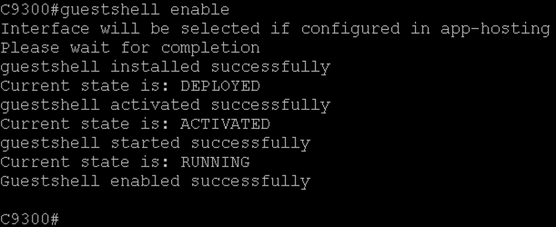
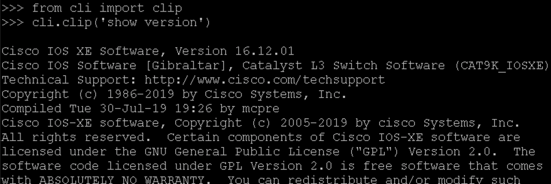

## [IOS XE Programmability Lab](https://github.com/jeremycohoe/cisco-ios-xe-programmability-lab)

## Module: Guestshell and On Box Python

## Topics Covered:
Guestshell and On-Box Python

Enable Guestshell

On-Box Interactive Python

Conclusion


## Guestshell and On-Box Python

In this section we will look at IOS XE's on-box Linux container and its capabilities. We will see how to enable it, how to use it to run Python scripts, and how to integrate it with EEM.

## Enable Guestshell

Guestshell Python runs in an LXC container. This container is managed by IOX, which is a container manager specifically for IOS XE which is similar in function to Docker. Before using the guestshell, we must enable IOX and then enable guestshell.

Step 1.  Open a SSH session to your C9300 switch

Step 2.  Enter the following command to check and enable **IOX** on the
device

```
C9300# show iox-service
```

All 5 services should be in "Runnning" state, if not, start IOX:

```
C9300#conf t
Enter configuration commands, one per line. End with CNTL/Z.
C9300(config)# iox
```

If required to restart IOX, simply issue the **no iox** command

Step 3. Configure guestshell interface with the following commands

```
c9300(config)# app-hosting appid guestshell

c9300(config-app-hosting)# vnic management guest-interface 0 guest-ipaddress 10.1.1.7 netmask 255.255.255.0 gateway 10.1.1.5

c9300(config-app-hosting)# end
```

Step 4.  Enable guestshell. Note that it takes IOX a minute or two to start. 

```
c9300# guestshell enable

Interface will be selected if configured in app-hosting

Please wait for completion

**< Wait one or two minutes >**

Guestshell activated successfully
Currate state is: ACTIVATED
guestshell started successfully
Current state is: RUNNING
Guestshell enabled successfully
```



Step 5. Enter the guestshell CLI. This guestshell container can access the device bootflash directly.

```
c9300# guestshell

[guestshell@guestshell ~]$
```

Step 6. Navigate to the bootflash directory. This is located at the root of
the guestshell filesystem.

```
[guestshell@guestshell ~]$ cd /bootflash
```

Step 7.  List the contents of the directory by using **ls** command

```
[guestshell@guestshell bootflash]$ **ls**

20180523-195811_shrun cat9k_LATEST_20170917_050621.SSA.bin
20180523-195917_shrun cat9k_iosxe.16.08.01a.SPA.bin
20180523-200022_shrun core
20180523-200043_shrun current_config_name
20180523-200113_shrun dc_profile_dir
CRDU dc_stats.txt
NVRAM diff
base-config gs_script
```

Step 8.  Exit the guestshell by sending exit command and returning to the IOS XE CLI

```
[guestshell@guestshell ~]$ **exit**
```

The guestshell environment is a typical Linux virtual machine -- it has all of the tools available, including Python, Bash, yum, vi, etc. There are many possibilities having this capabilities within the IOS XE networking device.

Lets look at extending Guesthshell further with Python.

## On-Box Interactive Python

Just as we can on Ubuntu or Windows, we can run the interactive python shell on IOS XE. We can also make CLI calls from here.

Step 1.  Run Python from the exec command line.

```
c9300#guestshell run python

Python 2.7.5 (default, Jun 17 2014, 18:11:42)

[GCC 4.8.2 20140120 (Red Hat 4.8.2-16)] on linux2

Type "help", "copyright", "credits" or "license" for more
information.

>>>

>>> print 'hello'

hello
```


Step 9. Now we will import the **cli** module and test sending CLI to the device.

```
>>> import cli

>>> cli.cli('show version')

'\ Cisco IOS XE Software, Version 16.12.01\nCisco IOS Software [Gibraltar], Catalyst L3 Switch Software (CAT9K_IOSXE), Version 16.12.1, RELEASE SOFTWARE (fc4)\nTechnical Support: http://
www.cisco.com/techsupport\nCopyright (c) 1986-2019 by Cisco Systems, Inc.\nCompiled Tue 30-Jul-19 19:26 by mcpre\nCisco IOS-XE software, Copyright (c) 2005-2019 by cisco Systems, Inc.\nAll rights reserved.
```

Step 10. Now we will import the **clip** function from CLI module and test sending CLI to the device. It will print in a stdout rather than returning it. **stdout**, also known as "standard output", is the file where a program writes its output data.

```
>>> **from cli import clip**

>>> **cli.clip('show version')**
```



```
Cisco IOS XE Software, Version 16.12.01

Cisco IOS Software [Gibraltar], Catalyst L3 Switch Software
(CAT9K_IOSXE), Version 16.12.1, RELEASE SOFTWARE (fc4)

Technical Support: http://www.cisco.com/techsupport

Copyright (c) 1986-2019 by Cisco Systems, Inc.

Compiled Tue 30-Jul-19 19:26 by mcpre

Cisco IOS-XE software, Copyright (c) 2005-2019 by cisco Systems, Inc.

All rights reserved. Certain components of Cisco IOS-XE software are

licensed under the GNU General Public License ("GPL") Version 2.0. The

software code licensed under GPL Version 2.0 is free software that
comes...
```

Notice that the ouptut of the **clip** function is much easier to read
than before.

Step 11. **configure** is another function available in the **cli** module to
provision the device. Create loopback 99 with ip address 99.99.99.99
using the **configure** function as follows.

```
cli.configure(["interface loopback 99", "ip address 99.99.99.99 255.255.255.255", "end"])
```

Step 12. Verify the interface **loopback 99** has been created by using the **clip** function.

```
>>> **cli.clip('show ip interface brief | e unset')**
```

 

Step 13. Exit the interactive shell by executing **quit()**  and exit Guesthshell to return to the IOS CLI by typing exit to exit from the Bash prompt

**Note:** CLI is not the only option for communicating with the device. We can install NCClient, for example, and use NETCONF to communicate from the on-box script to the switch. We could use PIP to install additional python files and modules, as well as yum to install additional system packages.

## Conclusion

In this module the Guestshell was configured, enabled, and the Python API was used to configure the IOS XE device. The example here is very basic, however, all IOS CLI functionality is available from the Python API within Guestshell, so there are many potential use cases that customers can implement as needed.
