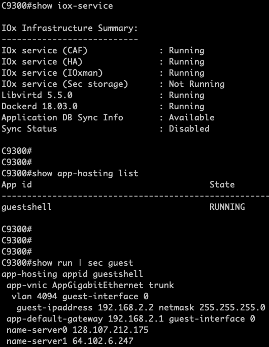
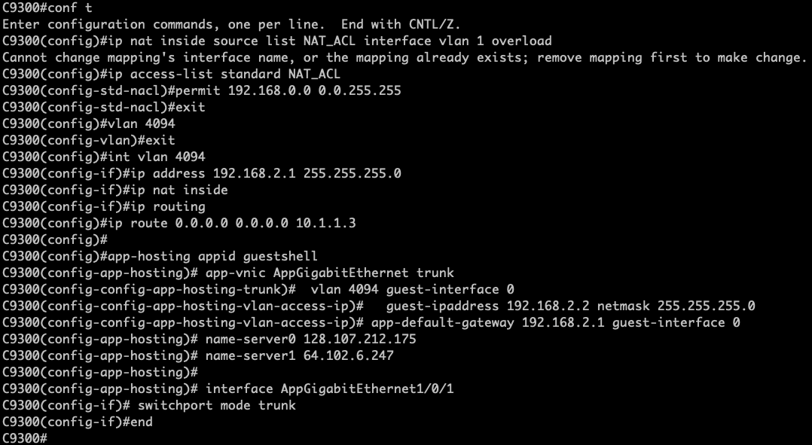
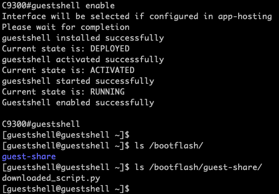

## [IOS XE Programmability Lab](https://github.com/jeremycohoe/cisco-ios-xe-programmability-lab)

## Module: Guestshell and Guest-share

## Topics Covered:
[Guestshell](#guestshell-with-guest-share)

[Enable Guestshell](#enable-guestshell)

[Conclusion](#conclusion)


## Guestshell with Guest-share

In this section we will look at IOS XE's on-box Linux container and its capabilities. We will see how to enable it, how to use it to run Python scripts, and how to integrate it with EEM.

## Enable Guestshell

Guestshell Python runs in an LXC container. This container is managed by IOX, which is a container manager specifically for IOS XE which is similar in function to Docker. Before using the guestshell, we must enable IOX and then enable guestshell.

Step 1.  Login to the RDP from the POD access sheet provided by the proctor and connect to the C9300 switch using terminal

```
auto@programmability:~$ ssh admin@10.1.1.5
Password: Cisco123
C9300# 
```

Step 2.  Enter the following command to check and enable **IOX** on the
device

```
C9300# show iox-service

IOx Infrastructure Summary:
---------------------------
IOx service (CAF)              : Running
IOx service (HA)               : Running
IOx service (IOxman)           : Running
IOx service (Sec storage)      : Not Running
Libvirtd 5.5.0                 : Running
Dockerd 18.03.0                : Running
Application DB Sync Info       : Available
Sync Status                    : Disabled
```

If the IOX services are not in the correct state as per above then the IOX service can be restarted by ending the "no iox, iox" CLI commands if needed:

```
C9300#conf t
Enter configuration commands, one per line. End with CNTL/Z.
C9300(config)# no iox
...
C9300(config)# iox
```

The **show iox-service** and the **show app-hosting list** is seen below, as well as the running configuration for the guest-shell section. This configuration may not yet be present in your switch, and can be added in Step3. **show app-hosting list** command may take up to 30 seconds to execute.




Additionally the **show app-hosting list** CLI can be used to show the state of the guestshell container:


```
C9300#show app-hosting list
No App found

or

C9300#show app-hosting list
App id                                   State
---------------------------------------------------------
guestshell                               RUNNING

C9300#
```


Step 3. Configure and enable guestshell with the following commands:

```
C9300#

conf t
ip nat inside source list NAT_ACL interface vlan 1 overload
ip access-list standard NAT_ACL
permit 192.168.0.0 0.0.255.255
exit
vlan 4094
exit
int vlan 4094
ip address 192.168.2.1 255.255.255.0
ip nat inside
ip routing
ip route 0.0.0.0 0.0.0.0 10.1.1.3

app-hosting appid guestshell
 app-vnic AppGigabitEthernet trunk
  vlan 4094 guest-interface 0
   guest-ipaddress 192.168.2.2 netmask 255.255.255.0
   exit
  exit
 app-default-gateway 192.168.2.1 guest-interface 0
 name-server0 128.107.212.175
 name-server1 64.102.6.247
 exit
interface AppGigabitEthernet1/0/1
 switchport mode trunk
end
```



Step 4.  Start the Guest Shell container to enter into the Bash shell by sending the **guestshell enable** followed by the **guestshell** CLI - Note that it may take up to 1 minute to enable and enter the container.

```
C9300#guestshell enable

<< wait about 30 seconds >>

Interface will be selected if configured in app-hosting
Please wait for completion
guestshell installed successfully
Current state is: DEPLOYED
guestshell activated successfully
Current state is: ACTIVATED
guestshell started successfully
Current state is: RUNNING
Guestshell enabled successfully

C9300#guestshell

<< wait about 1 minute >>

[guestshell@guestshell ~]$

```
Note: if you get any "iox feature is not enabled" error like below then do "no iox" and "iox" in the configuration mode.

```
C9300#guestshell enable 
 iox feature is not enabled
C9300# 
C9300#conf t
Enter configuration commands, one per line.  End with CNTL/Z.
C9300(config)#no iox
C9300(config)#iox
C9300(config)#end
```



Step 5. Enter the guestshell CLI. This guestshell container can access the device bootflash **guest-share** directory only.

```
c9300# guestshell

[guestshell@guestshell ~]$ df
Filesystem     1K-blocks    Used Available Use% Mounted on
/dev/loop11       991020  265963    675057  29% /
tmpfs            3875564    9956   3865608   1% /cisco/cisco_cli
tmpfs            3875564  138600   3736964   4% /cisco/.iosp_socket
/dev/sdb3       11087104 4638656   5885248  45% /bootflash/guest-share
tmpfs                 64       0        64   0% /sys/fs/cgroup
devfs                 64       0        64   0% /dev
/dev/loop10         1050      21       955   3% /data
rootfs           3852604  115392   3737212   3% /local/local1/core_dir
tmpfs            3875564       0   3875564   0% /dev/shm
tmpfs            3875564    4144   3871420   1% /run
none             3875564       8   3875556   1% /var/volatile
[guestshell@guestshell ~]$
[guestshell@guestshell ~]$
[guestshell@guestshell ~]$ cd /bootflash/
[guestshell@guestshell bootflash]$ ls
guest-share
[guestshell@guestshell bootflash]$ ls
guest-share
[guestshell@guestshell guest-share]$ ls
downloaded_script.py

[guestshell@guestshell guest-share]$
```

In the example above, the bootflash folder is empty except for the one shared folder: guest-share

```
[guestshell@guestshell ~]$ python3 --version
Python 3.6.8
[guestshell@guestshell ~]$
```

In the example above we show that Python3 is installed.

Step 6.  Exit the guestshell by sending exit command and returning to the IOS XE CLI

```
[guestshell@guestshell ~]$ exit
```

The guestshell environment is a typical Linux virtual machine -- it has all of the tools available, including Python, Bash, yum, vi, etc. There are many possibilities having this capabilities within the IOS XE networking device.


## Conclusion

In this module the Guestshell was configured, enabled, and the guest-shared folder was explored. 
